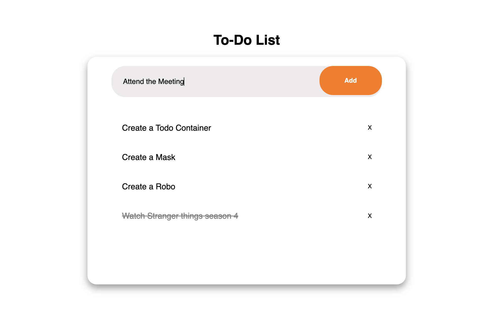

# Interactive To-Do List Application

## Overview
The **Interactive To-Do List Application** is a simple web-based task manager that allows users to:
- Add new tasks
- Mark tasks as complete
- Remove tasks
- Persist tasks using `localStorage`

This project uses **HTML, CSS, and JavaScript** for the UI and logic, utilizing **DOM manipulation** to create a dynamic and interactive experience.

---

## Features
- **Add tasks**: Users can input a task and add it to the list.
- **Mark tasks as completed**: Clicking on a task toggles its completion status.
- **Delete tasks**: Users can remove tasks from the list.
- **Persistence**: Tasks are stored in `localStorage` so they remain even after page refresh.

---

## Code Explanation

### **HTML Structure** (`index.html`)
- The structure includes a container with an input box and a button for adding tasks.
- The task list is dynamically populated via JavaScript.

```html
<input type="text" id="task-input" placeholder="Add a new task"/>
<button class="task-button" onclick="addTask()">Add</button>
<ul class="list-container"></ul>
```

### **JavaScript Functionality** (`script.js`)

#### **1. Loading Tasks from Local Storage**
```js
document.addEventListener("DOMContentLoaded", function () {
    loadTasks();
});
```
- When the page loads, the `loadTasks()` function retrieves saved tasks from `localStorage` and renders them.

#### **2. Adding a New Task**
```js
function addTask() {
    const taskInput = document.getElementById('task-input');
    const taskValue = taskInput.value.trim();
    if (taskValue === "") return;

    let task = { text: taskValue, completed: false };
    let tasks = JSON.parse(localStorage.getItem("taskList")) || [];

    tasks.push(task);
    localStorage.setItem("taskList", JSON.stringify(tasks));
    renderTask(task, tasks.length - 1);
    taskInput.value = "";
}
```
- Retrieves input value, trims whitespace, and checks if empty.
- Creates a task object and stores it in `localStorage`.
- Calls `renderTask()` to update the UI.

#### **3. Rendering a Task in the UI**
```js
function renderTask(task, index) {
    let taskList = document.querySelector(".list-container");
    let li = document.createElement("li");
    li.innerHTML = `
        <span class="${task.completed ? 'completed' : ''}" onclick="toggleTask(${index})">${task.text}</span>
        <button class="close" onclick="deleteTask(${index})">X</button>
    `;
    taskList.appendChild(li);
}
```
- Dynamically creates an `<li>` for each task.
- Uses a `<span>` with an `onclick` event to toggle completion.
- Adds a delete button for task removal.

#### **4. Toggling Task Completion**
```js
function toggleTask(index) {
    let tasks = JSON.parse(localStorage.getItem("taskList")) || [];
    tasks[index].completed = !tasks[index].completed;
    localStorage.setItem("taskList", JSON.stringify(tasks));
    loadTasks();
}
```
- Toggles the `completed` property of a task and updates `localStorage`.
- Reloads the task list to reflect changes.

#### **5. Deleting a Task**
```js
function deleteTask(index) {
    let tasks = JSON.parse(localStorage.getItem("taskList")) || [];
    tasks.splice(index, 1);
    localStorage.setItem("taskList", JSON.stringify(tasks));
    loadTasks();
}
```
- Removes the selected task from the array and updates `localStorage`.
- Reloads the task list.

---

## **CSS Styling** (`styles.css`)

- Styles the container with a **shadow box** and rounded corners.
- Uses **flexbox** for centering elements.
- Applies **hover effects** on buttons.
- Provides a **strike-through effect** for completed tasks.

```css
.completed {
    text-decoration: line-through;
    color: gray;
}
```

---

## Output



---

## Conclusion
This project is a great example of a beginner-friendly **JavaScript project** that demonstrates core **DOM manipulation** and **localStorage** concepts.


