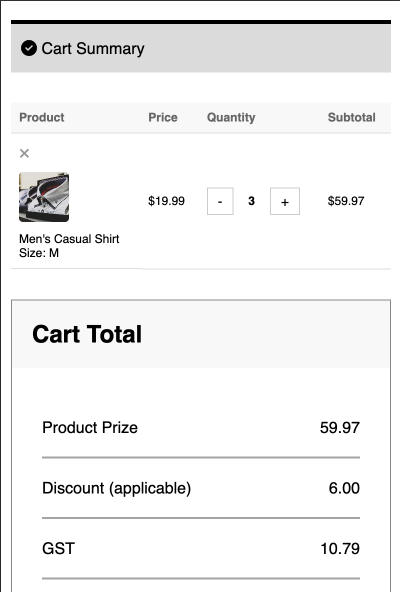

# eCommerce Shopping Cart

## Overview
This is a simple eCommerce shopping cart application built using JavaScript. It allows users to add, remove, and update items in their cart.

## Features
- Add products to the cart
- Remove products from the cart
- Update product quantity
- Calculate total price dynamically
- Store cart data in local storage

## Installation
1. Clone this repository:
   ```sh
   git clone https://github.com/your-repo/shopping-cart.git
   ```
2. Navigate to the project directory:
   ```sh
   cd shopping-cart
   ```
3. Open `index.html` in a browser.

## Usage
### Adding Items to the Cart
```js
function addToCart(productId, name, price) {
    let cart = JSON.parse(localStorage.getItem("cart")) || [];
    let product = cart.find(item => item.id === productId);
    
    if (product) {
        product.quantity += 1;
    } else {
        cart.push({ id: productId, name, price, quantity: 1 });
    }
    
    localStorage.setItem("cart", JSON.stringify(cart));
    updateCartUI();
}
```

### Removing Items from the Cart
```js
function removeFromCart(productId) {
    let cart = JSON.parse(localStorage.getItem("cart")) || [];
    cart = cart.filter(item => item.id !== productId);
    localStorage.setItem("cart", JSON.stringify(cart));
    updateCartUI();
}
```

### Updating Quantity
```js
function updateQuantity(productId, quantity) {
    let cart = JSON.parse(localStorage.getItem("cart")) || [];
    let product = cart.find(item => item.id === productId);
    if (product) {
        product.quantity = quantity;
        localStorage.setItem("cart", JSON.stringify(cart));
        updateCartUI();
    }
}
```

### Calculating Total Price
```js
function calculateTotal() {
    let cart = JSON.parse(localStorage.getItem("cart")) || [];
    return cart.reduce((total, item) => total + item.price * item.quantity, 0).toFixed(2);
}
```

## Technologies Used
- HTML
- CSS
- JavaScript (ES6)

## Output
Below is an image of the output when navigating between different views:




## License
This project is licensed under the MIT License.

