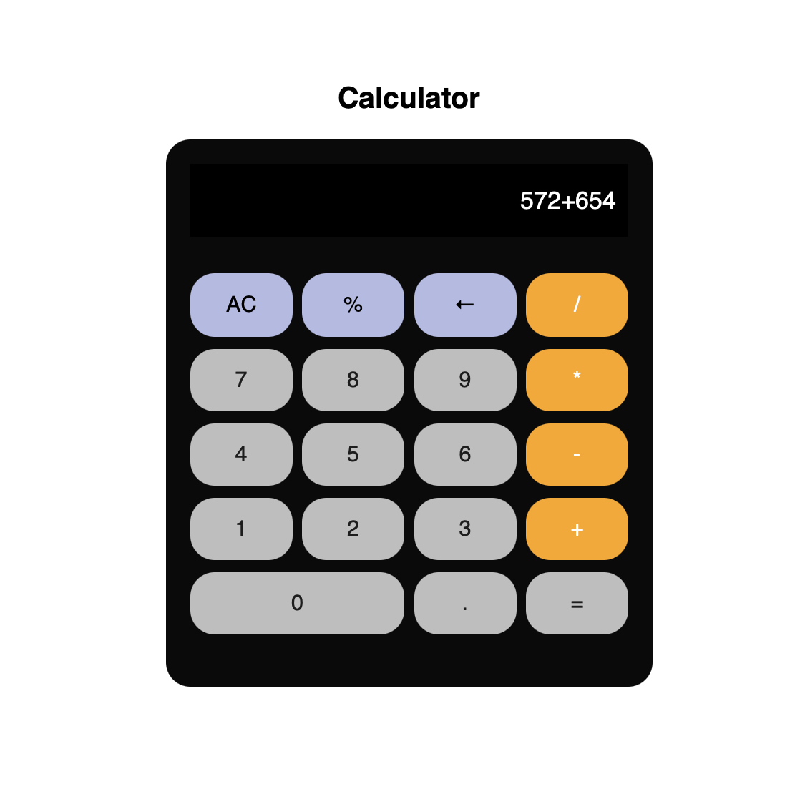

# Simple Calculator

## Overview
This is a simple web-based calculator that performs basic arithmetic operations such as addition, subtraction, multiplication, and division. The calculator provides a user-friendly interface with number and operator buttons, dynamically updating the display as the user interacts with it.

## Features
- Supports addition, subtraction, multiplication, and division.
- Includes a clear (AC) button to reset the input.
- Allows users to delete the last entered character.
- Displays real-time user input and calculated results.
- Styled with CSS for an aesthetically pleasing interface.

## Technologies Used
- **HTML** for the structure.
- **CSS** for styling and layout.
- **JavaScript** for functionality and event handling.

## File Structure
```
/Calculator
│── index.html       # Main HTML file
│── styles.css       # Styling file
│── script.js        # JavaScript logic
```

## Code Explanation

### HTML (`index.html`)
- Creates the structure of the calculator.
- Provides buttons for numbers (0-9) and arithmetic operations.
- Uses an input field to display user input and results.

```html
<input type="text" class="input-field" id="display"/>
<button onclick="appendToDisplay('7')">7</button>
<button onclick="appendToDisplay('+')">+</button>
<button onclick="calculateResult()">=</button>
```

### JavaScript (`script.js`)
- **`appendToDisplay(value)`**: Adds user input to the display.

```js
function appendToDisplay(value){
    document.getElementById("display").value += value;
}
```

- **`deleteLastChar()`**: Deletes the last character from the display.

```js
function deleteLastChar(){
    document.getElementById("display").value = document.getElementById("display").value.slice(0,-1);
}
```

- **`clearDisplay()`**: Clears the input field.

```js
function clearDisplay(){
    document.getElementById("display").value = "";
}
```

- **`calculateResult()`**: Evaluates the arithmetic expression and updates the display.

```js
function calculateResult(){
    try {
        let result = eval(document.getElementById("display").value);
        document.getElementById("display").value = result;
    } catch (error) {
        document.getElementById("display").value = "Error";
    }
}
```

### CSS (`styles.css`)
- **Button Layout**: Styled with `grid-template-columns` to arrange buttons neatly.
- **Display Styling**: Black background with white text for better visibility.

```css
.buttons {
    display: grid;
    grid-template-columns: repeat(4, 1fr);
    gap: 8px;
    row-gap: 10px;
}

button {
    padding: 15px;
    font-size: 18px;
    border-radius: 20px;
    border: none;
    background-color: rgb(190, 190, 190);
}
```

## Output



Enjoy using your simple calculator! 🚀

