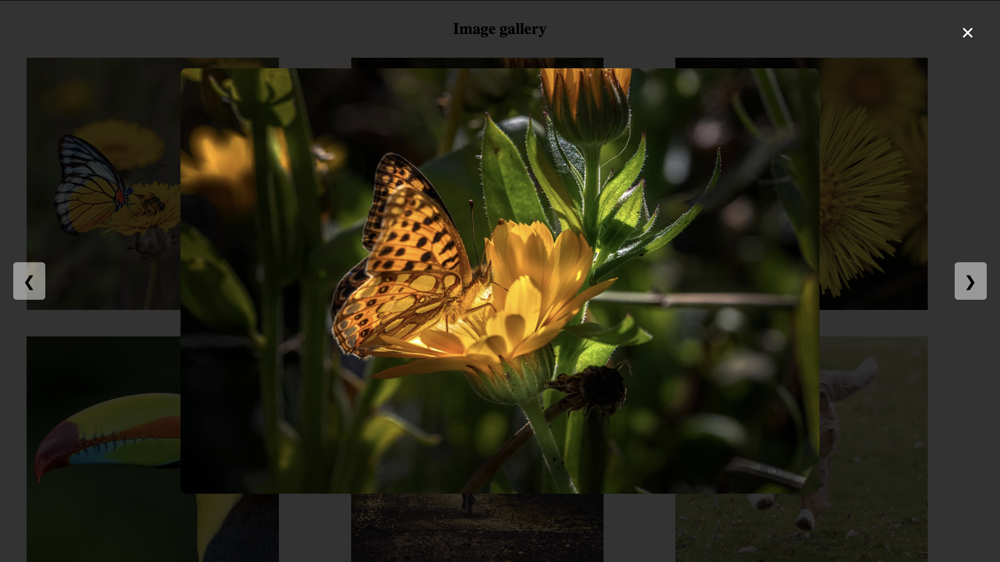

# Image Gallery Lightbox

## Objective
Develop an image gallery where clicking a thumbnail opens a larger version in a modal/lightbox overlay.

## Features
- Clicking on an image thumbnail opens a larger view in a lightbox.
- Users can navigate through images using previous and next buttons.
- Clicking outside the image or pressing `Escape` closes the lightbox.
- Smooth transitions and animations for an enhanced user experience.

## Technologies Used
- HTML
- CSS
- JavaScript

## Installation
1. Clone the repository or download the source files.
2. Open `index.html` in a web browser.

## Code Explanation

### HTML Structure
- The gallery consists of multiple `` elements inside a `<div class="gallery">`.
- A `<div class="lightbox">` is used for displaying the enlarged image.
- Navigation buttons (`prev`, `next`) allow users to navigate between images.

### JavaScript Functionality
#### 1. **Selecting Elements**
```javascript
document.addEventListener("DOMContentLoaded",()=> {
    const thumbnails = document.querySelectorAll('.thumbnail');
    let lightbox = document.querySelector('.lightbox');
    let lightboxImg = document.getElementById('lightboxImg');
    let closebtn = document.getElementById('closebtn');
    let prevbtn = document.getElementById('prevBtn');
    let nextbtn = document.getElementById('nextBtn');
    let images = [];
    let currIndex = 0;
```
- Stores all thumbnails in `thumbnails`.
- Initializes `lightbox`, `lightboxImg`, `closebtn`, `prevbtn`, `nextbtn`.
- Creates an array `images[]` to store image sources.
- `currIndex` keeps track of the currently displayed image.

#### 2. **Opening the Lightbox**
```javascript
    thumbnails.forEach((thumbnail,index)=> {
        images.push(thumbnail.getAttribute('src'));
        thumbnail.addEventListener("click",()=>{
            currIndex = index;
            openLigthBox();
        })
    });
```
- Loops through all thumbnails and adds event listeners.
- On click, updates `currIndex` and calls `openLightBox()`.

#### 3. **Displaying Selected Image**
```javascript
    function openLigthBox(){
        lightboxImg.src = images[currIndex];
        lightbox.classList.add('active');
    }
```
- Updates `lightboxImg.src` with the selected image.
- Adds `active` class to display the lightbox.

#### 4. **Closing the Lightbox**
```javascript
    function closeLightBox(){
        lightbox.classList.remove('active');
    }
    closebtn.addEventListener("click", closeLightBox);
```
- Removes `active` class to hide the lightbox.
- Close button (`×`) triggers `closeLightBox()`.

#### 5. **Navigating Through Images**
```javascript
    function showprevImage(){
        currIndex = (currIndex-1 + images.length) % images.length;
        lightboxImg.src = images[currIndex];
    }
    function shownextImage(){
        currIndex = (currIndex+1) % images.length;
        lightboxImg.src = images[currIndex];
    }
    prevbtn.addEventListener("click", showprevImage);
    nextbtn.addEventListener("click", shownextImage);
```
- Uses modulo logic to loop between images.
- Left (`prev`) and right (`next`) buttons navigate between images.

#### 6. **Keyboard Navigation**
```javascript
    document.addEventListener("keydown", (e) => {
        if (lightbox.classList.contains("active")) {
            if (e.key === "ArrowLeft") showprevImage();
            if (e.key === "ArrowRight") shownextImage();
            if (e.key === "Escape") closeLightBox();
        }
    });
```
- Left and right arrow keys navigate images.
- `Escape` key closes the lightbox.

### CSS Styling
- `.gallery` uses a grid layout to organize images.
- `.thumbnail` scales up slightly on hover for an interactive effect.
- `.lightbox` is initially hidden using `opacity: 0; visibility: hidden;`.
- `.lightbox.active` makes the lightbox visible.
- `.prev`, `.next`, `.close` buttons are styled for better user interaction.

## Output Screenshot



## Future Enhancements
- Add smooth transition effects when switching images.
- Allow swiping gestures for touch devices.
- Add captions or descriptions for images.

## Conclusion
This image gallery lightbox is a simple yet interactive way to showcase images. It provides smooth navigation with keyboard support and a clean UI.


