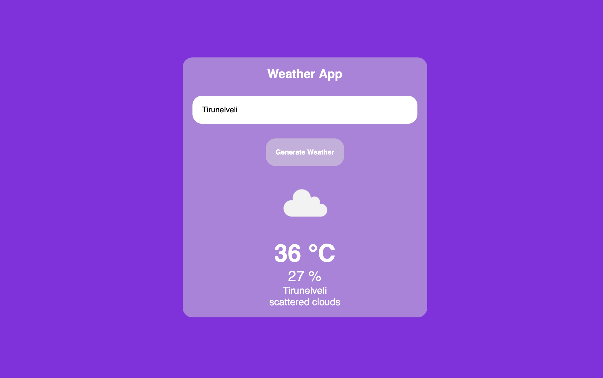

# Weather App with API Integration

## Overview
This project is a simple Weather App that allows users to fetch and display weather information by entering a city name. The application uses the OpenWeatherMap API to retrieve weather data and presents it in a user-friendly interface.

## Features
- Fetches real-time weather data using the OpenWeatherMap API.
- Displays temperature, humidity, and weather conditions.
- Updates the UI dynamically based on user input.
- Provides error handling for invalid city names or network issues.

## Technologies Used
- HTML
- CSS
- JavaScript (ES6+)
- OpenWeatherMap API

## How It Works
1. The user enters a city name in the input field.
2. When the "Generate Weather" button is clicked, a request is made to the OpenWeatherMap API.
3. The application retrieves and displays:
   - Temperature (in Celsius)
   - Humidity (in percentage)
   - Weather condition (e.g., cloudy, sunny)
   - A corresponding weather icon
4. If the city name is invalid, an error message is logged in the console.

## Code Explanation

### HTML Structure
```html
<div class="weather-container">
    <h2>Weather App</h2>
    <input type="text" id="city" placeholder="Enter Your City"/>
    <button onclick="generateWeather()" class="btn">Generate Weather</button>
    
    <div id="weather-temp"></div>
    <div id="weather-hum"></div>
    <div id="weather-info"></div>
</div>
```
- The input field allows users to enter a city name.
- A button triggers the `generateWeather()` function to fetch data.
- Weather details are displayed dynamically in the `weather-temp`, `weather-hum`, and `weather-info` divs.
- An image element (`weather-icon`) is used to show the corresponding weather icon.

### JavaScript Functionality

```javascript
async function generateWeather(){
    const apikey = "YOUR_API_KEY";
    let city = document.getElementById("city").value.trim();
    const apiUrl = `https://api.openweathermap.org/data/2.5/weather?q=${city}&appid=${apikey}`;

    try{
        const res = await fetch(apiUrl);
        if (!res.ok) throw new Error("City not found!");

        const data = await res.json();
        displayWeatherData(data);
    }
    catch(e){
        console.log(e.message);
    }
}
```
- Uses `fetch()` to request data from OpenWeatherMap.
- Handles errors gracefully with a `try-catch` block.

```javascript
function displayWeatherData(data){
    const tempInfo = document.getElementById('weather-temp');
    const humInfo =  document.getElementById('weather-hum');
    const weatherInfo = document.getElementById('weather-info');
    const weatherIcon = document.getElementById('weather-icon');
    
    const cityName = data.name;
    const temp = Math.round(data.main.temp - 273.15);
    const hum = data.main.humidity;
    const desc = data.weather[0].description;
    const iconcode = data.weather[0].icon;
    const iconurl = `https://openweathermap.org/img/wn/${iconcode}@4x.png`;
    
    tempInfo.innerHTML = `<p>${temp} °C</p>`;
    humInfo.innerHTML = `<p>${hum} %</p>`;
    weatherInfo.innerHTML= `<p>${cityName}</p><p>${desc}</p>`;

    weatherIcon.src = iconurl;
    weatherIcon.alt = desc;
    weatherIcon.classList.add('active');
}
```
- Extracts and displays weather details from the API response.
- Converts temperature from Kelvin to Celsius.
- Dynamically updates the UI elements.

### CSS Styling
```css
.weather-container{
    width: 500px;
    background-color: rgba(211, 211, 211, 0.5);
    border-radius: 20px;
    padding: 20px;
    text-align: center;
}
.weather-container input{
    margin-top: 30px;
    width: 100%;
    padding: 20px;
    border-radius: 20px;
}
.btn{
    margin-top: 30px;
    padding: 20px;
    background-color: rgba(221, 220, 220, 0.5);
    border-radius: 20px;
    cursor: pointer;
}
```
- The weather container is styled with a semi-transparent background.
- Input fields and buttons are rounded and centered.
- The weather icon is displayed conditionally.

## Output



