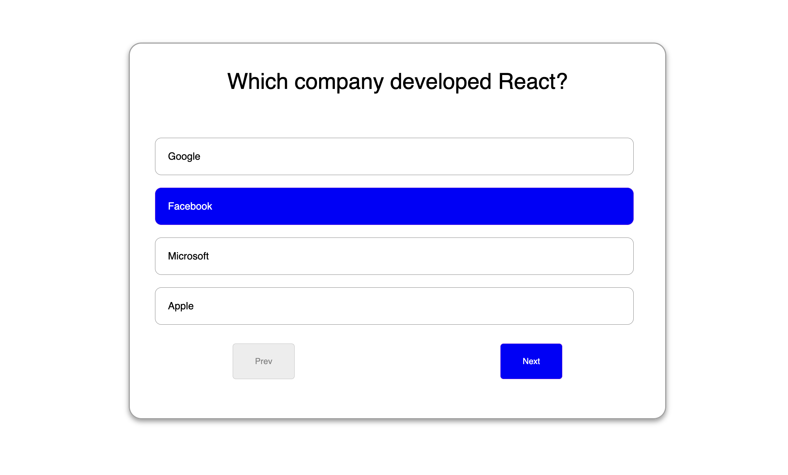

# Dynamic Quiz Application

## Overview
The Dynamic Quiz Application is a JavaScript-based interactive quiz that dynamically loads questions from a JSON file and tracks user scores. The app allows users to navigate through questions, select answers, and receive their final score.

## Features
- Loads quiz questions from an external `questions.json` file.
- Uses event listeners to capture user selections.
- Allows users to navigate between questions.
- Calculates and displays the final score at the end of the quiz.

## Technologies Used
- HTML
- CSS
- JavaScript (Vanilla JS)

## How It Works

### 1. Loading Questions
```javascript
fetch("questions.json")
    .then(res => res.json())
    .then(data => {
        questions = data;
        loadQuestions();
    })
    .catch((e) => console.error("Error loading questions:", e));
```
- Fetches questions from the `questions.json` file.
- Parses the JSON response and stores it in the `questions` array.
- Calls `loadQuestions()` to display the first question.

### 2. Displaying Questions & Options
```javascript
function loadQuestions() {
    const question = questions[currquesindex];
    questionSection.innerHTML = `<p>${question.question}</p>`;
    optionsSection.innerHTML = "";
    question.options.forEach((option, index) => {
        const li = document.createElement("li");
        li.textContent = option;
        li.classList.add("option");
        li.addEventListener("click", () => {
            document.querySelectorAll(".option").forEach(opt => opt.classList.remove("selected"));
            li.classList.add("selected");
            selectedAnswers.set(currquesindex, index);
        });
        optionsSection.appendChild(li);
    });
}
```
- Updates the `quiz-section` with the current question.
- Generates multiple-choice options dynamically.
- Adds a click event listener to highlight the selected option.

### 3. Navigating Through Questions
```javascript
nextBtn.addEventListener("click", () => {
    if (currquesindex < questions.length - 1) {
        currquesindex++;
        loadQuestions();
    }
});

prevBtn.addEventListener("click", () => {
    if (currquesindex > 0) {
        currquesindex--;
        loadQuestions();
    }
});
```
- `Next` and `Previous` buttons allow users to move between questions.
- Ensures navigation stays within valid bounds.

### 4. Submitting the Quiz and Calculating Score
```javascript
subBtn.addEventListener("click", () => {
    let score = 0;
    questions.forEach((question, index) => {
        if (selectedAnswers.get(index) === question.correct) {
            score++;
        }
    });
    quizcontainer.style.display = "none";
    resultContainer.innerHTML=`<h2>Your score: ${score} / ${questions.length}</h2>`;
    alert(`Your score: ${score} / ${questions.length}`);
});
```
- Loops through selected answers and compares them with correct answers.
- Displays the final score at the end of the quiz.

## Styling (CSS)
The quiz interface is designed with:
- A centered layout for readability.
- Highlighting selected options.
- Buttons for navigation and submission.

## Output Screenshot
  


Enjoy the quiz! 🚀