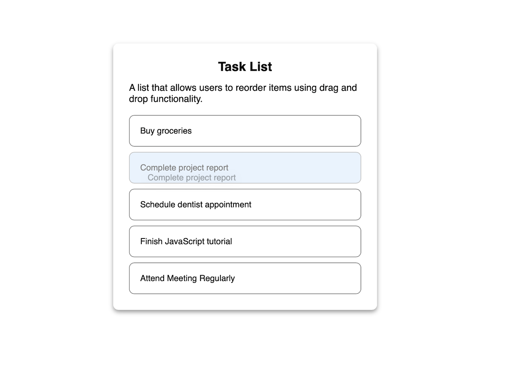

# Drag and Drop List Reordering

## Overview
This project implements a dynamic list that allows users to reorder items using drag and drop functionality. It leverages the HTML5 Drag and Drop API to enable smooth user interactions.

## Features
- Users can drag and drop list items to reorder them.
- Provides visual feedback during the drag operation.
- Updates the DOM to reflect the new order after the drop.

## Technologies Used
- HTML
- CSS
- JavaScript (Drag and Drop API)

## How It Works
### HTML Structure
The application consists of a list wrapped inside a `<div>` container:
```html
<ul class="draggable-list" id="draggable-list">
    <li>Complete project report</li>
    <li>Buy groceries</li>
    <li>Schedule dentist appointment</li>
    <li>Finish JavaScript tutorial</li>
    <li>Attend Meeting Regularly</li>
</ul>
```

### JavaScript Implementation
#### 1. Selecting the List and Initializing Drag Events
```javascript
const list = document.getElementById("draggable-list");
let draggedItem = null;
```
This initializes the list and sets a `draggedItem` variable to keep track of the item being dragged.

#### 2. Handling Drag Start Event
```javascript
list.addEventListener("dragstart", (event) => {
    draggedItem = event.target;
    event.target.classList.add("dragging");  
});
```
When a user starts dragging a list item, it gets stored in `draggedItem` and a CSS class is added for styling.

#### 3. Handling Drag Over Event
```javascript
list.addEventListener("dragover", (event) => {
    event.preventDefault();
    const afterElement = getDragAfterElement(list, event.clientY);
    if(afterElement == null){
        list.appendChild(draggedItem);
    }
    else{
        list.insertBefore(draggedItem, afterElement);
    }
});
```
This ensures that the dragged item can be moved within the list and dynamically placed based on the user's cursor position.

#### 4. Handling Drag End Event
```javascript
list.addEventListener("dragend", (event) => {
    event.target.classList.remove("dragging");
    draggedItem = null;
});
```
Removes the styling when the drag action is completed.

#### 5. Finding the Closest Item for Reordering
```javascript
function getDragAfterElement(container, y){
    const draggableElements = [...container.querySelectorAll("li:not(.dragging)")];
    return draggableElements.reduce((closest, child) => {
        const box = child.getBoundingClientRect();
        const offset = y - box.top - box.height / 2;
        if (offset < 0 && offset > closest.offset) {
            return { offset: offset, element: child };
        } else {
            return closest;
        }
    }, { offset: Number.NEGATIVE_INFINITY }).element;
}
```
This function calculates the closest element to determine the correct position for the dragged item.

### CSS Styling
```css
.draggable-list li{
    padding: 20px;
    border: 1px solid gray;
    border-radius: 10px;
    cursor: grab;
}
.dragging {
    opacity: 0.5;
    background: #d1e7fd;
}
```
The `.dragging` class reduces opacity to indicate that an item is being dragged.

## Output



## Future Enhancements
- Save the updated order to local storage.
- Add animations for smoother transitions.
- Provide a reset button to revert to the original order.

---
Enjoy using the drag-and-drop reordering feature! 🚀