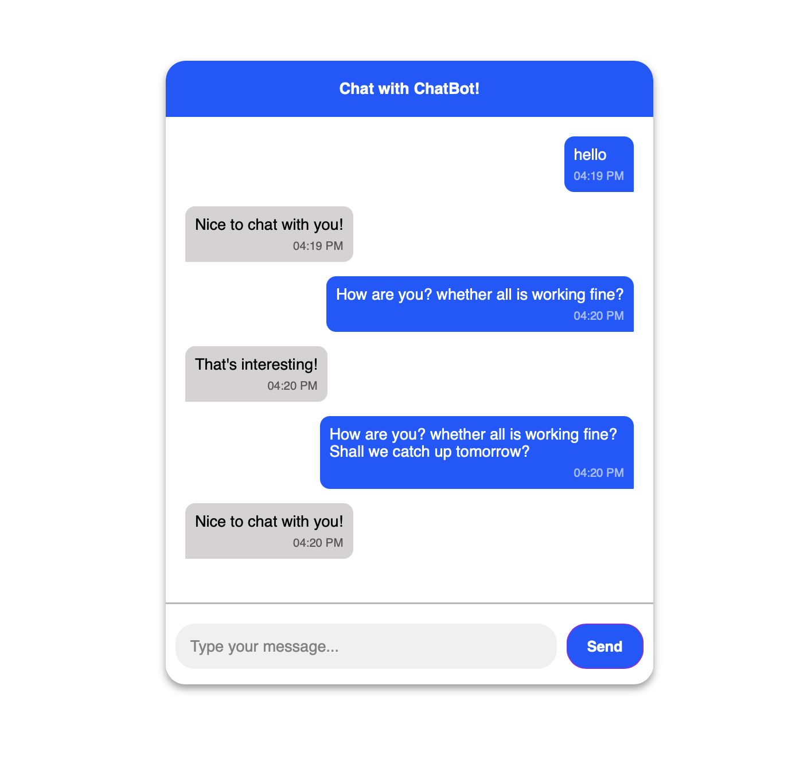

# Real-time Chat Simulation

## Objective
Develop a chat interface that simulates real-time messaging without requiring a backend.

## Features
- A chat window that displays user and bot messages dynamically.
- Simulated bot responses using `setTimeout`.
- User input handling with timestamps for each message.

---

## Code Explanation

### HTML Structure
- The `chat-container` holds the entire chat interface.
- `chat-header` provides a title.
- `chat-window` displays messages dynamically.
- `chat-input` includes an input field and send button for user interaction.

```html
<div class="chat-container">
    <div class="chat-header">Chat with ChatBot!</div>
    <div class="chat-window" id="chat-window"></div>
    <div class="chat-input">
        <input type="text" id="field-input" placeholder="Type your message..."/>
        <button class="input-btn" id="input-btn">Send</button>
    </div>
</div>
```

### JavaScript Logic
#### Selecting Elements
```javascript
const chatbox = document.getElementById("chat-window");
const chatInput = document.getElementById("field-input");
const chatBtn = document.getElementById("input-btn");
```
- Retrieves the chat window, input field, and send button elements.

#### Event Listeners
```javascript
chatBtn.addEventListener("click",()=>sendMessage());
chatInput.addEventListener("keypress", (e) => {
    if (e.key === "Enter") sendMessage();
});
```
- Listens for a button click or Enter key press to send a message.

#### Adding Messages
```javascript
function addMessage(message,user){
    const msgDiv = document.createElement('div');
    msgDiv.classList.add("message",user);
    const timeOptions = { hour: '2-digit', minute: '2-digit' };
    const formattedTime = new Date().toLocaleTimeString([], timeOptions);
    msgDiv.innerHTML = `${message} <div class='timestamp'>${formattedTime}</div>`;
    chatbox.appendChild(msgDiv);
    chatbox.scrollTop = chatbox.scrollHeight;
}
```
- Creates a new message element, formats the timestamp, appends it to the chat window, and scrolls to the latest message.

#### Sending User Message
```javascript
function sendMessage(){
    const text = chatInput.value.trim();
    if(text === "") return;
    addMessage(text,"user");
    chatInput.value="";
    setTimeout(()=>botReply(),1000);
}
```
- Sends the user message and triggers the bot response after 1 second.

#### Simulating Bot Reply
```javascript
function botReply(){
    const responses = [
        "Hello! How can I help?",
        "That's interesting!",
        "Can you tell me more?",
        "I'm just a bot, but I'm listening!",
        "Nice to chat with you!"
    ];
    const randommessage = responses[Math.floor(Math.random() * responses.length)];
    addMessage(randommessage,"bot");
}
```
- Selects a random bot response and adds it to the chat.

### CSS Styling
- The chat container is styled with a shadow, rounded corners, and spacing.
- User and bot messages have distinct background colors.
- The chat input is styled for a clean user experience.

```css
.chat-container{
    width: 500px;
    height: 640px;
    box-shadow: 0px 4px 8px rgba(0,0,0,0.4);
    border-radius: 20px;
    overflow: hidden;
}
.message.user{
    align-self: flex-end;
    background-color: rgb(0, 89, 255);
    color: white;
    border-radius: 10px;
}
.message.bot{
    align-self: flex-start;
    background-color: #d5d2d2;
    border-radius: 10px;
}
.timestamp{
    font-size: 12px;
    opacity: 0.6;
    text-align: right;
}
```

---

## Output Screenshot


This chat simulation provides an interactive messaging experience with a chatbot, making it useful for frontend UI demonstrations without requiring a backend setup.

