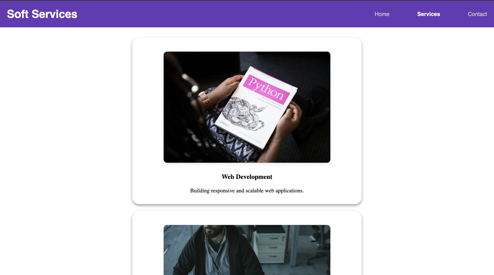

# Single-Page Application (SPA) with Hash-based Routing

## Objective
Build a basic Single-Page Application (SPA) that navigates between different views without reloading the page.

## Features
- Implements hash-based routing by listening to the `window.onhashchange` event.
- Dynamically loads different content sections based on the current URL hash.
- Maintains a consistent UI and state across route changes.

## Project Structure
```
project-folder/
│── index.html
│── styles.css
│── script.js
│── assets/
│   ├── laptop.jpg
│   ├── contact.jpg
```

## Code Explanation

### HTML Structure (`index.html`)
- The navigation bar contains links with hash-based URLs (`#home`, `#services`, `#contacts`).
- A `<div class="page">` is used to dynamically update the content based on the selected route.

```html
<header class="topnav">
    <h1>Soft Services</h1>
    <nav class="navbar">
        <ul>
            <li><a href="#home" id="nav-home" class="active">Home</a></li>
            <li><a href="#services" id="nav-services">Services</a></li>
            <li><a href="#contacts" id="nav-about">Contact</a></li>
        </ul>
    </nav>
</header>
```

### JavaScript for Hash-based Routing (`script.js`)

1. **Define Routes:** The `routes` object maps hash values to their corresponding content.
2. **Event Listeners:**
   - `window.onhashchange`: Detects hash changes and loads the relevant content.
   - `window.onload`: Ensures the correct content is displayed on the initial page load.
3. **Dynamic Content Loading:** The `handleRouting()` function updates the `.page` div with the corresponding section.

```js
const routes = {
    "": getHomePage(),
    "home": getHomePage(),
    "contacts": getContactPage(),
    "services": getServicesPage()
};

function handleRouting() {
    const hash = window.location.hash.substring(1) || 'home';
    document.querySelector(".page").innerHTML = routes[hash] || `<h2>Page Not Found</h2>`;
    document.querySelectorAll(".navbar ul li a").forEach(link => {
        link.classList.toggle("active", link.getAttribute("href") === `#${hash}`);
    });
}

window.addEventListener("hashchange", handleRouting);
window.addEventListener("load", handleRouting);
```

### Styling (`styles.css`)
- Styles the navigation bar, content area, and service cards.
- Applies animations for a smoother transition.

```css
.container {
    width: 100%;
    display: flex;
    align-items: center;
    justify-content: center;
}

.page {
    margin-top: 30px;
    display: flex;
    flex-direction: column;
    justify-content: center;
    align-items: center;
    gap: 20px;
    text-align: center;
    border-radius: 20px;
}

nav ul li a.active {
    color: rgb(250, 250, 250);
    font-weight: bold;
}
```

## Output
Below is an image of the output when navigating between different views:




## Conclusion
This project demonstrates a simple hash-based routing mechanism to create a basic SPA. It allows seamless navigation between different pages without refreshing the browser.