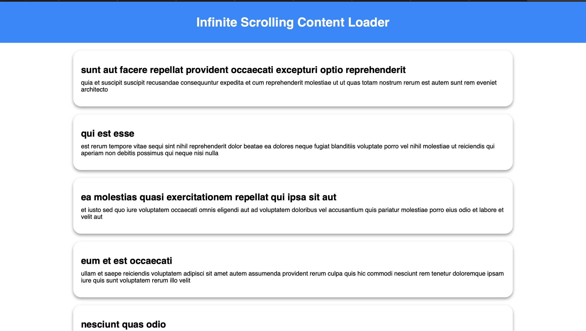

# Infinite Scrolling Content Loader

## Objective
The objective of this project is to create a web page that dynamically loads additional content as the user scrolls towards the bottom of the page. This enhances user experience by providing a seamless and interactive browsing experience.

## Features
- Detects when the user is near the bottom of the page using the `scroll` event.
- Fetches additional content asynchronously using the Fetch API.
- Ensures smooth performance and seamless user experience.
- Displays a loading spinner while fetching new content.

## How It Works

### HTML Structure (`index.html`)
The HTML consists of:
- A header section with a title.
- A `#content` div where dynamically loaded posts will be displayed.
- A `loading` div with a spinner for indicating data loading.
- A `script.js` file for handling infinite scrolling functionality.

```html
<!DOCTYPE html>
<html lang="en">
<head>
    <meta charset="UTF-8">
    <meta name="viewport" content="width=device-width, initial-scale=1.0">
    <title>Infinite Scroll</title>
    <link rel="stylesheet" href="styles.css">
</head>
<body>
    <header>
        <h1>Infinite Scrolling Content Loader</h1>
    </header>
    <div id="content"></div>
    <div class="loading">
        <div class="spinner"></div>
    </div>
    <script src="script.js"></script>
</body>
</html>
```

### JavaScript Functionality (`script.js`)

#### Key Functionalities:
1. **Event Listener Setup:**
   - The script runs once the DOM content is fully loaded.
   - Fetches initial data on page load.
   - Listens for the `scroll` event to check when the user reaches the bottom.

2. **Scroll Event Detection:**
   - Uses `window.addEventListener("scroll", handleScroll);`
   - Checks `scrollTop + clientHeight >= scrollHeight - 10` to determine if the user is near the bottom.

3. **Fetching Data:**
   - Uses the Fetch API to retrieve posts from a placeholder API (`https://jsonplaceholder.typicode.com/posts`).
   - Appends the fetched posts to the `#content` div.
   - Shows the loading spinner while fetching data.

#### Code:
```javascript
document.addEventListener("DOMContentLoaded", () => {
    const contentSection = document.getElementById("content");
    const loadingIcon = document.querySelector(".loading");
    let page = 1;
    let loading = false;

    fetchData();
    window.addEventListener("scroll", handleScroll);

    function handleScroll() {
        const { scrollTop, scrollHeight, clientHeight } = document.documentElement;

        if (scrollTop + clientHeight >= scrollHeight - 10) {
            fetchData();
        }
    }

    async function fetchData() {
        if (loading) return;
        loading = true;
        loadingIcon.style.display = "block"; 
        try {
            const response = await fetch(`https://jsonplaceholder.typicode.com/posts?_limit=10&_page=${page}`);
            const data = await response.json();
            
            data.forEach(post => {
                const item = document.createElement("div");
                item.classList.add("post");
                item.innerHTML = `<h2>${post.title}</h2><p>${post.body}</p>`;
                contentSection.appendChild(item);
            });
            page++;
        }
        catch (e) {
            console.error("Error fetching data:", e);
        } finally {
            loading = false;
            loadingIcon.style.display = "none"; 
        }
    }
});
```

### Styling (`styles.css`)
- **General styles** for header, content section, and loading spinner.
- **Animation effect** for smoothly displaying new content.

```css
* {
    margin: 0;
    box-sizing: border-box;
    font-family: sans-serif;
}

header {
    text-align: center;
    padding: 35px 25px;
    background-color: rgb(0, 136, 255);
    color: white;
}

#content {
    width: 75%;
    margin: auto;
    display: flex;
    flex-direction: column;
    gap: 20px;
}

.post {
    padding: 35px 20px;
    background-color: white;
    border-radius: 20px;
    box-shadow: 0px 4px 8px rgba(0,0,0,0.4);
    animation: fadeIn 0.5s forwards;
}

.loading {
    display: none;
    text-align: center;
    margin: 20px 0;
}

.spinner {
    width: 40px;
    height: 40px;
    border: 4px solid rgba(0, 0, 0, 0.1);
    border-top: 4px solid #3498db;
    border-radius: 50%;
    animation: spin 1s linear infinite;
    margin: auto;
}

@keyframes fadeIn {
    from { opacity: 0; }
    to { opacity: 1; }
}

@keyframes spin {
    0% { transform: rotate(0deg); }
    100% { transform: rotate(360deg); }
}
```

## Output Image
(Include a screenshot of the running application showing infinite scrolling in action)

---

### Summary
- **Infinite scrolling** dynamically loads new content when the user reaches the bottom of the page.
- Uses **Fetch API** to retrieve and display posts asynchronously.
- **Smooth animations** and loading indicators enhance user experience.
- **Error handling** ensures robust performance.

Let me know if you need any further refinements! 🚀